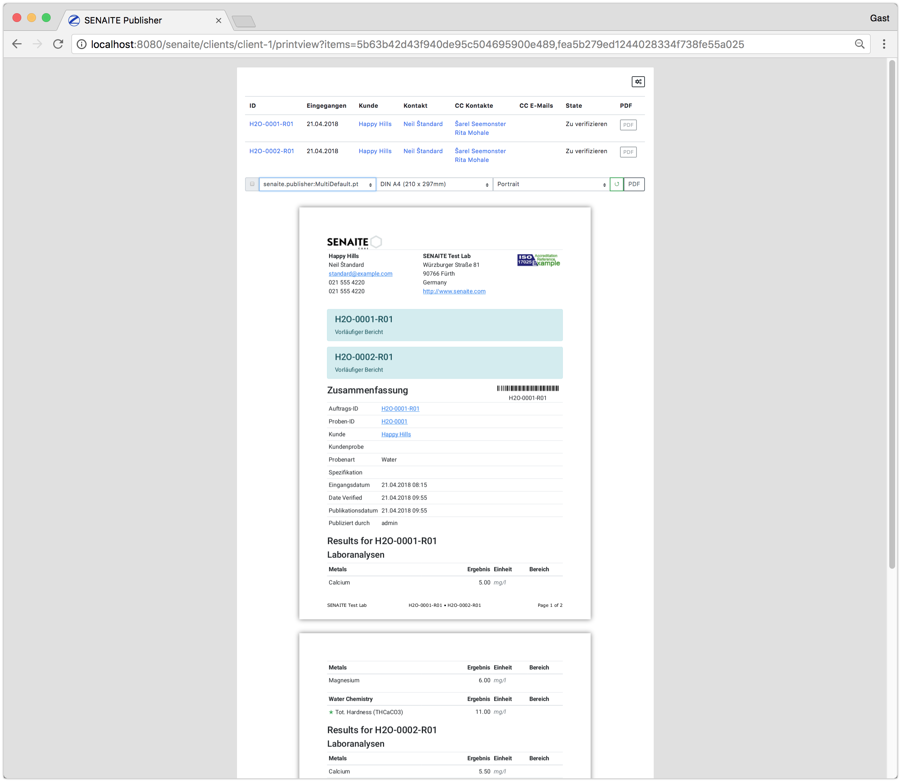
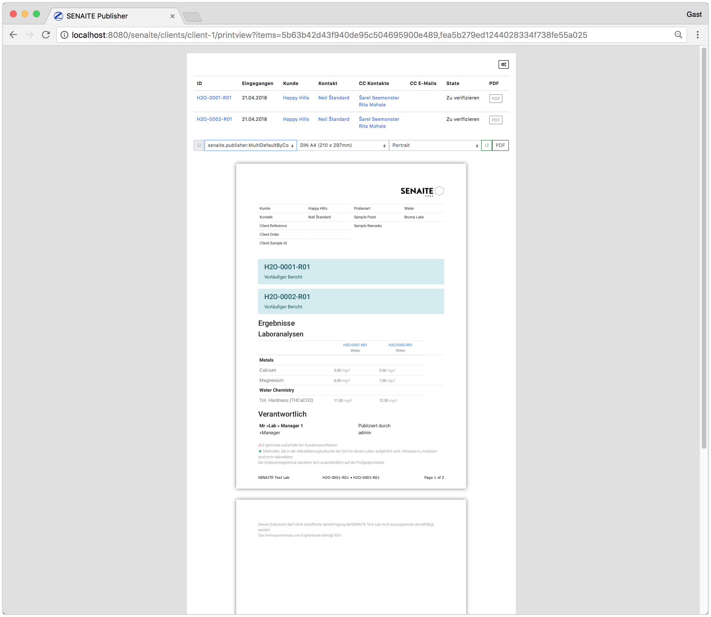

<div align="center">

  <a href="https://github.com/senaite/senaite.publisher">
    
  </a>
  <p>Publication of HTML/PDF Reports in SENAITE</p>

</div>

## Hello World

The easiest way to get started with `senaite.publisher` is to copy a template in
the `templates/reports` folder within this package.


The smallest report example looks like this:

```html
<h1>Hello World!</h1>
```

It renders a heading saying “Hello, world!” on the report.


The next few sections will gradually introduce you to using `senaite.publisher`.
We will examine single- and multi reports, Zope page templates and the report model.
Once you master them, you can create complex reports for SENAITE.

## Single/Multi Reports

The difference between single- and multi reports is that a single reports
receive a single report object, while multi reports receive a collection of
report objects.

`senaite.publisher` uses the report name to distinguish between a single- and
multi report. A report starting or ending with the workd `Multi`, e.g.
`MultiReport.pt` or `MultiReport.html` will be considered as a multi report and
it will receive all selected objects in a collection.

All other reports, e.g. `Default.pt`, `HelloWorld.pt`, `SingleReport.pt` will be
considered as single reports.

The most basic single report looks like this:

```html
<tal:report define="model python:view.model;">
  <h1 tal:content="model/id">This will be replaced with the ID of the model</h1>
</tal:report>
```

It renders the ID of the model (in this case the Analysis Request `H2O-0001-R01`) on the report.


To render a multi report, we need to copy the previous template to `MultiHelloWorld.pt`.

The most basic multi report looks like this:

```html
<tal:report define="collection python:view.collection;">
  <tal:model tal:repeat="model collection">
    <h1 tal:content="model/id">This will be replaced with the ID of the model</h1>
  </tal:model>
</tal:report>
```

It renders the IDs of the model (in this case the Analysis Requests
`H2O-0001-R01` and `H2O-0002-R01`) on the same report.


Change between the templates `HelloWorld.pt` and `MultiHelloWorld.pt` to see how
the two selected Analysis Requests render either on two pages or on one page.

## Zope Page Templates

[Zope Page Templates](http://zope.readthedocs.io/en/latest/zope2book/ZPT.html)
is the main web page generation tool in SENAITE.

Page Templates are recommended way to generate reports in `senaite.publisher`.
We have already seen a small example how to use the Template Attribute Language
(TAL). TAL consists of special tag attributes. For example, we used a dynamic
page headline in the previous reports:

```html
<h1 tal:content="model/id">This will be replaced with the ID of the model</h1>
```

## Report Model

The Report Model is a special wrapper object for database objects in SENAITE.
The advantage of Report Models is that they provide transparent access to all
content schema fields in a preformance optimized way.

For example the content type
[Analysis Request](https://github.com/senaite/senaite.core/blob/master/bika/lims/content/analysisrequest.py)
in SENAITE defines a computed field `SampleTypeTitle`:
https://github.com/senaite/senaite.core/blob/master/bika/lims/content/analysisrequest.py#L1548

To access this field in a report, you simply traverse it by name:

```html
<tal:report define="model python:view.model;">
  <h1 tal:content="model/id">This will be replaced with the ID of the model</h1>
  <h2>
    Sample Type:
    <span tal:content="model/SampleTypeTitle">
      This will be replaced with the Sample Type Title
    </span>
  </h2>
</tal:report>
```

Now it should render the title of the sample type below the ID of the Analysis Request:


## Bootstap

`senaite.publisher` uses [Bootstrap 4](https://getbootstrap.com) as the main front-end component library.
Each report will therefore follow these style guidelines and can be easily extended.

Please note, that you should start with [Rows](https://getbootstrap.com/docs/4.0/layout/grid/#how-it-works)
as the top level element inside a report to maintain the borders of the selected paper format.

```html
<tal:report define="model python:view.model;">
  <div class="row">
    <div class="col-sm-12">
      <h1 tal:content="model/id">This will be replaced with the ID of the model</h1>
      <h2>
        Sample Type:
        <span class="text-secondary"
              tal:content="model/SampleTypeTitle">
          This will be replaced with the Sample Type Title
        </span>
      </h2>
    </div>
  </div>
</tal:report>
```


## Customizing the report design

To customize the style of your report, it is recommended to add the CSS style inline.

```html
<tal:report define="model python:view.model;">

  <tal:css define="laboratory view/laboratory;">
    <style type="text/css">
     html, body { font-size: 1em; }
     h1 { font-size: 160%; }
     h2 { font-size: 120%; }
     @page {
       font-size: 9pt;
       @top-left {
         content: '<span tal:omit-tag="" tal:content="laboratory/Name"/>';
       }
       @top-right {
         content: "<tal:t i18n:translate=''>Page</tal:t> " counter(page) " <tal:t i18n:translate=''>of</tal:t> " counter(pages);
       }
     }
    </style>
  </tal:css>

  <div class="row">
    <div class="col-sm-12">
      <h1 tal:content="model/id">This will be replaced with the ID of the model</h1>
      <h2>
        Sample Type:
        <span class="text-secondary"
              tal:content="model/SampleTypeTitle">
          This will be replaced with the Sample Type Title
        </span>
      </h2>
    </div>
  </div>
</tal:report>
```


## Reports in external packages

Until now we created all reports on the file system within this package, which
is **not** the recommended way, because with future updates of
`senaite.publisher` these changes will be lost.

Therefore it is recommended to create a new
[SENAITE Add-On Package](https://docs.plone.org/4/en/develop/addons/schema-driven-forms/creating-a-simple-form/creating-a-package.html)
and put the custom reports in there.

In your new package `configure.zcml` you have to specify the folder where your reports live:

```xml
<configure
    xmlns="http://namespaces.zope.org/zope"
    xmlns:plone="http://namespaces.plone.org/plone">

  <!-- Report resource directory -->
  <plone:static
      directory="reports"
      type="senaite.publisher.reports"/>

</configure>
```

This will integrate the `reports` directory within your package into the search path of `senaite.publisher`.


## Further Reading

`senaite.publisher` comes with some default templates included. It is
recommended to read the code of these templates or use them as the base for new
reports.

### senaite.publisher:Default.pt

This page template is renders single reports (one AR per report).


### senaite.publisher:MultiDefault.pt

This page template is renders multiple reports on one report. The header and
footer will be rendered only once. The meta data of the first model (Analysis
Request) will be used for these sections and the results
section/remarks/attachments etc. sections will be repeated for all models in the
collection.




### senaite.publisher:MultiDefaultByColumn.pt

This page template behaves like the `senaite.publisher:MultiDefault.pt`, except
that the results of all models (Analysis Requests) will be rendered in columns
side by side.


