<div align="center">
  <a href="https://github.com/senaite/senaite.impress">
    
  </a>
  <p>Publication of HTML/PDF Reports in SENAITE</p>

  <div>
    <a href="https://pypi.python.org/pypi/senaite.impress">
      
    </a>
    <a href="https://github.com/senaite/senaite.impress/pulls">
      
    </a>
    <a href="https://github.com/senaite/senaite.impress/issues">
      
    </a>
    <a href="#">
      
    </a>
    <a href="https://www.senaite.com">
      
    </a>
  </div>
</div>


## About

SENAITE IMPRESS is basically a rendering engine for HTML documents to PDF. It
supports any kind of international paperformat with their corresponding paper
dimensions, portrait and landscape orientation and merging of multiple PDFs to
one document.


## Installation

SENAITE IMPRESS is included in the SENAITE LIMS distribution, so no further
installation steps are needed.

To learn more about how to install SENAITE, please follow the
[SNEAITE Installation Manual](https://www.senaite.com/docs/installation)


## Usage

SENAITE IMPRESS opens automatically when a Sample is published, prepublished or
repupublished.

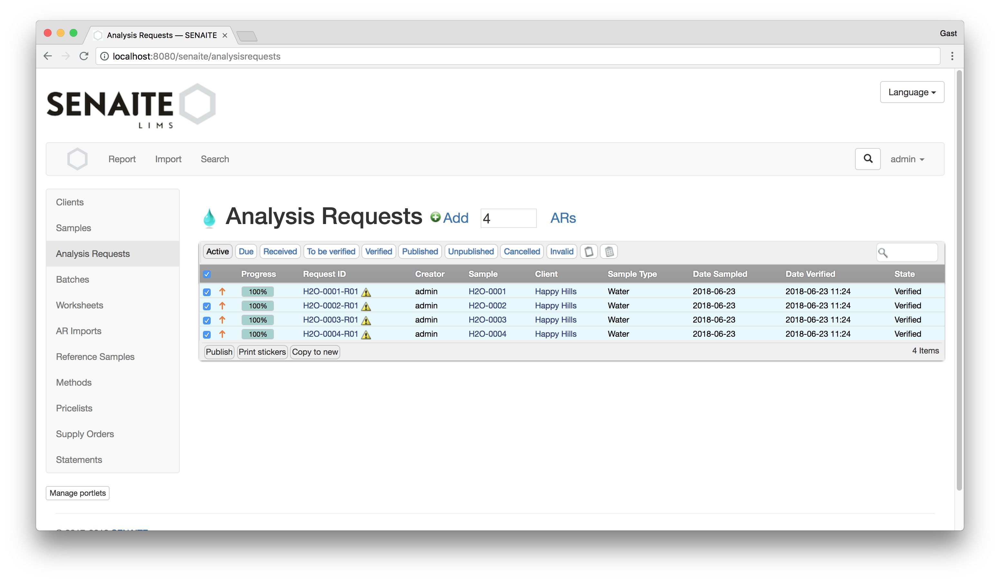

The above screenshot shows 4 Analysis Requests in the workflow state "Verified".
Select them and click the "Publish" Button.

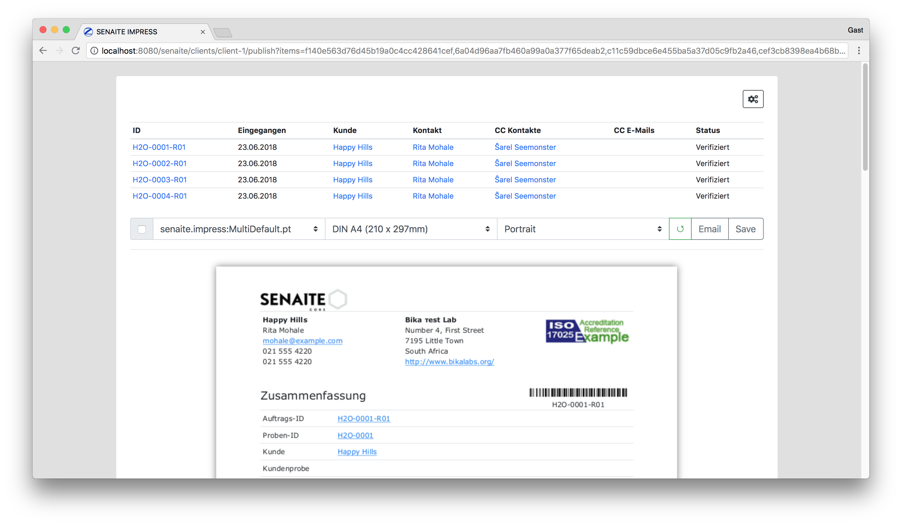

The SENAITE IMPRESS preview allows you to change the report template,
paperformat and the orientation.

The "merge" checkbox creates a single PDF, even when no multi-template was selected.

The button "Save" will do the following actions:

- Generate the PDF and store it below the corresponding Analysis Request
- Redirect to the "Analysis Reports" view of the customer
- Keep the current Workflow state (Publication is only done by sending the Email)

The button "Email" will do the same actions as "Save", but redirects directly to the Email view.


### Analysis Reports Listing View

A new tab *Analysis Reports* will be available for Clients, which lists all
generated PDF reports for all Analysis Requests of this client. Reports can be
selected in this listing for email delivery. This also allows to send multiple
PDF Analysis Reports in a single Email.

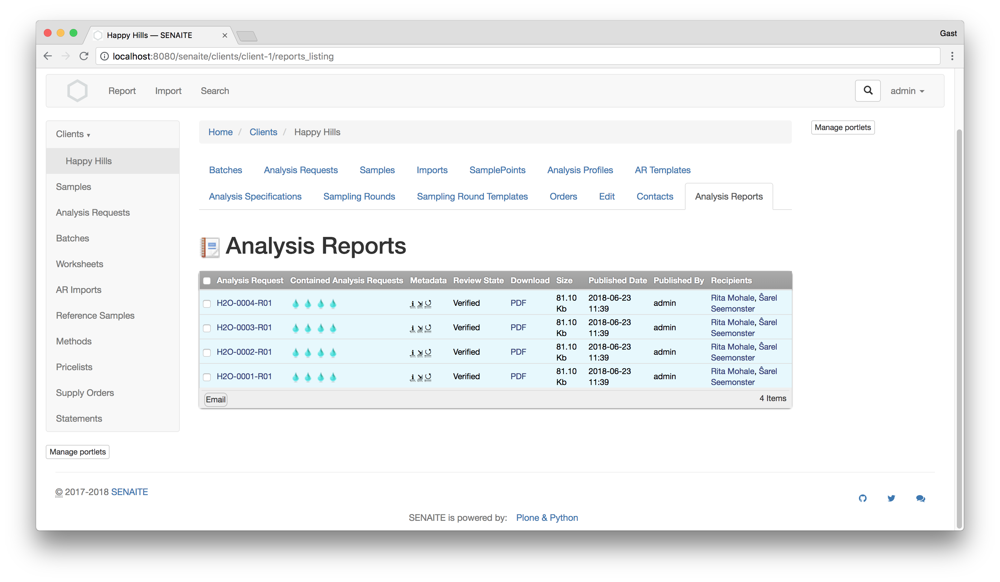

Selecting one or more Reports allows to send the generated PDFs to the selected
contacts of the Analysis Request.

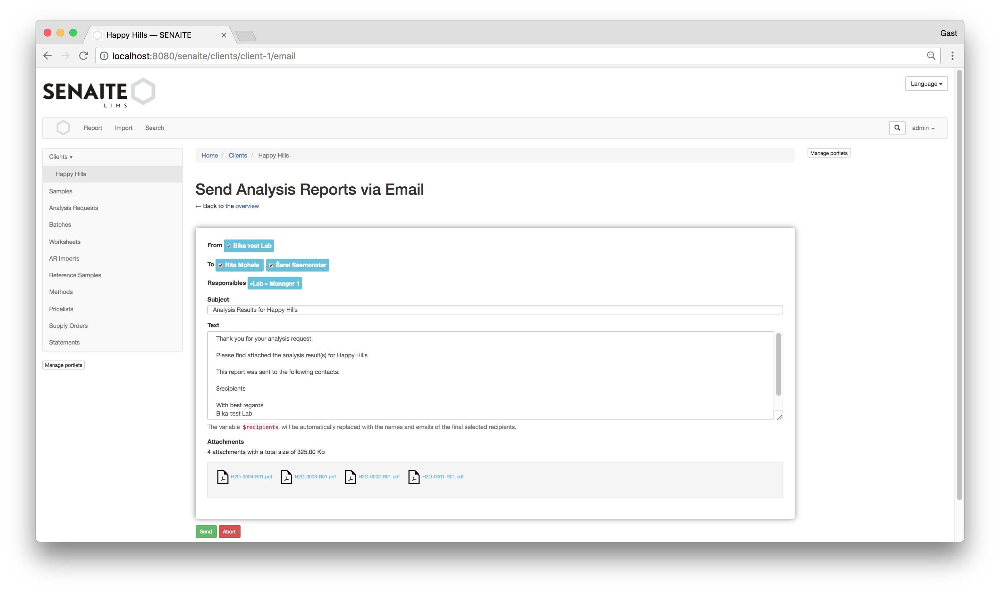

If the Email was successfully sent, the corresponding Analysis Requests change
the state to "Published".

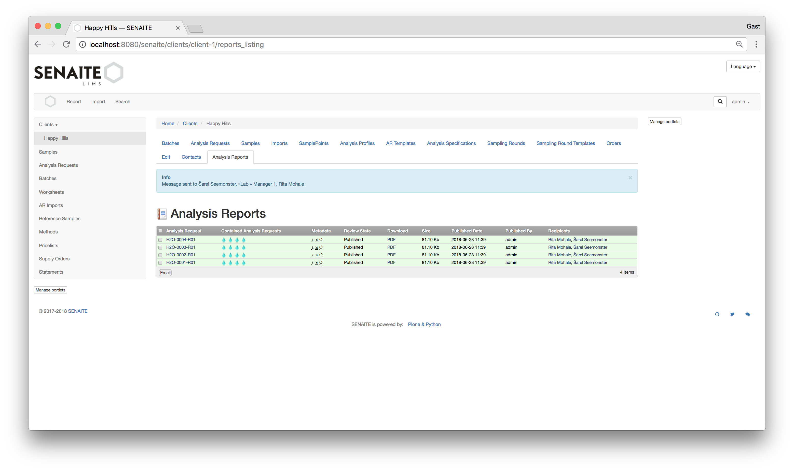

After you clicked the "Send" button, the Email with the attched reports are
delivered to the selected recipients.

The workflow states of the Analysis Requests have changed their state to "Published".


**Note**

In the case that multiple Analysis Requests are rendered in a single Report, the
contained Analysis Requests are also published when this Report was send.


## Custom Reports

Most of the labs require custom reports and SENAITE IMPRESS allows you to do
that with relative ease.

The following sections will guide you through the process of creating a custom report.


### Hello World

The easiest way to get started with `senaite.impress` is to copy one of the
existing templates in the `templates/reports` folder within this package.


The smallest report example looks like this:

```html
<h1>Hello World!</h1>
```

It renders a heading saying “Hello, world!” on the report.

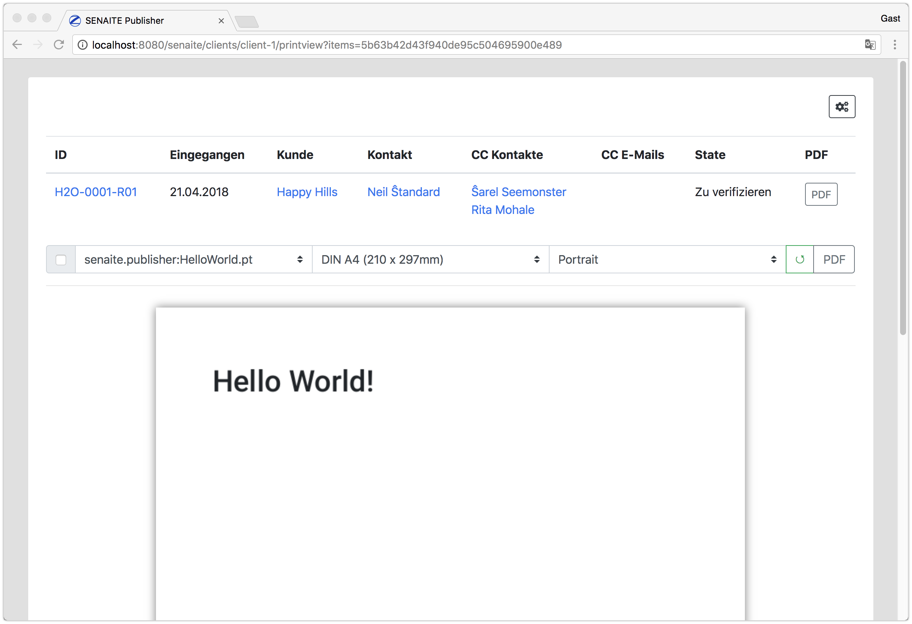

The next few sections will gradually introduce you to using `senaite.impress`.
We will examine single- and multi reports, Zope page templates and the super model.
Once you master them, you can create complex reports for SENAITE.


### Single/Multi Reports

The difference between single- and multi reports is that a single reports
receive a single report object, while multi reports receive a collection of
report objects.

`senaite.impress` uses the report name to distinguish between a single- and
multi report. A report starting or ending with the workd `Multi`, e.g.
`MultiReport.pt` or `PublicationReportMulti.pt` will be considered as a multi
report and it will receive all selected objects in a `collection`.

All other reports, e.g. `Default.pt`, `HelloWorld.pt`, `SingleReport.pt` will be
considered as single reports and it will receive the single report as its `model`.

The most basic single report looks like this:

```html
<tal:report define="model python:view.model;">
  <h1 tal:content="model/id">This will be replaced with the ID of the model</h1>
</tal:report>
```

It renders the ID of the model (in this case the Analysis Request `H2O-0001-R01`) on the report.


To render a multi report, we need to copy the previous template to `MultiHelloWorld.pt`.

The most basic multi report looks like this:

```html
<tal:report define="collection python:view.collection;">
  <tal:model tal:repeat="model collection">
    <h1 tal:content="model/id">This will be replaced with the ID of the model</h1>
  </tal:model>
</tal:report>
```

It renders the IDs of the model (in this case the Analysis Requests
`H2O-0001-R01` and `H2O-0002-R01`) on the same report.

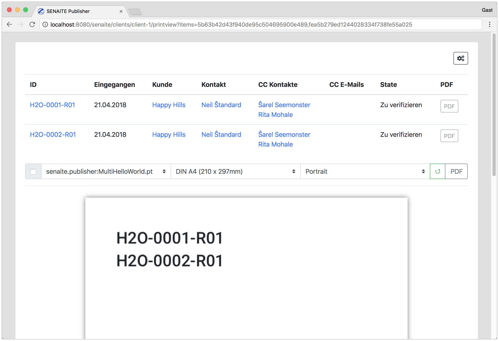

Change between the templates `HelloWorld.pt` and `MultiHelloWorld.pt` to see how
the two selected Analysis Requests render either on two pages or on one page.


### Zope Page Templates

[Zope Page Templates](http://zope.readthedocs.io/en/latest/zope2book/ZPT.html)
is the main web page generation tool in SENAITE.

Page Templates are recommended way to generate reports in `senaite.impress`.
We have already seen a small example how to use the Template Attribute Language
(TAL). TAL consists of special tag attributes. For example, we used a dynamic
page headline in the previous reports:

```html
<h1 tal:content="model/id">This will be replaced with the ID of the model</h1>
```

### Super Model

The [Super Model](https://github.com/senaite/senaite.core.supermodel#readme) is
a special wrapper object for database objects in SENAITE.

The advantage of Super Models is that they provide transparent access to all
content schema fields in a preformance optimized way.

Also see: https://github.com/senaite/senaite.core.supermodel#readme

For example the content type
[Analysis Request](https://github.com/senaite/senaite.core/blob/master/bika/lims/content/analysisrequest.py)
in SENAITE defines a computed field `SampleTypeTitle`.

To access this field in a report, you simply traverse it by name:

```html
<tal:report define="model python:view.model;">
  <h1 tal:content="model/id">This will be replaced with the ID of the model</h1>
  <h2>
    Sample Type:
    <span tal:content="model/SampleTypeTitle">
      This will be replaced with the Sample Type Title
    </span>
  </h2>
</tal:report>
```

Now it should render the title of the sample type below the ID of the Analysis Request:

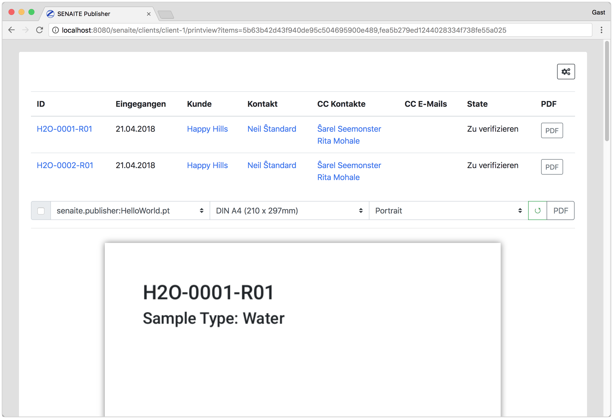


### Bootstrap

`senaite.impress` uses [Bootstrap 4](https://getbootstrap.com) as the main front-end component library.
Each report will therefore follow these style guidelines and can be easily extended.

Please note, that you should start with
[Rows](https://getbootstrap.com/docs/4.0/layout/grid/#how-it-works) as the top
level HTML element inside a report to maintain the borders of the selected paper
format.

```html
<tal:report define="model python:view.model;">
  <div class="row">
    <div class="col-sm-12">
      <h1 tal:content="model/id">This will be replaced with the ID of the model</h1>
      <h2>
        Sample Type:
        <span class="text-secondary"
              tal:content="model/SampleTypeTitle">
          This will be replaced with the Sample Type Title
        </span>
      </h2>
    </div>
  </div>
</tal:report>
```

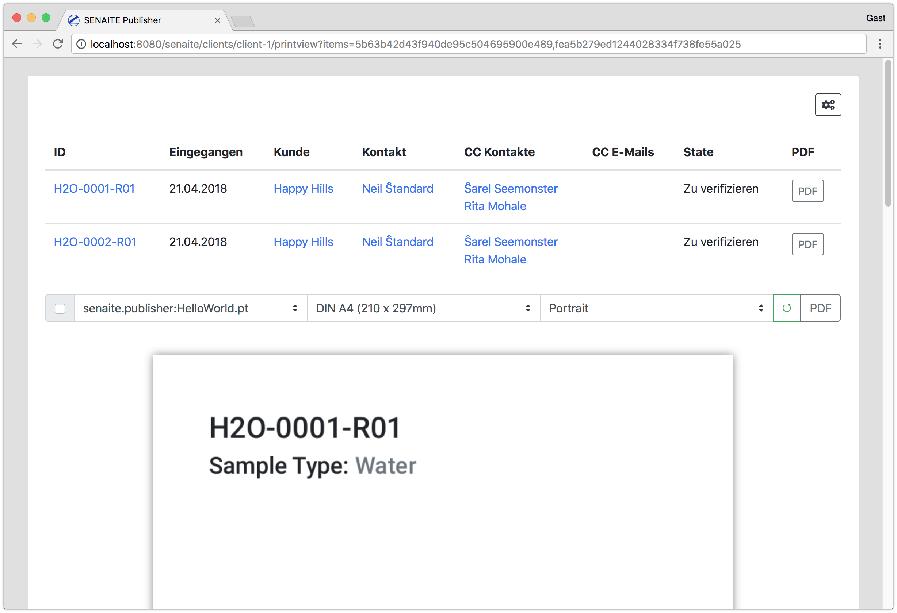


### Customizing the report design

To customize the style of your report, it is recommended to add the CSS style inline.

```html
<tal:report define="model python:view.model;">

  <tal:css define="laboratory view/laboratory;">
    <style type="text/css">
     html, body { font-size: 1em; }
     h1 { font-size: 160%; }
     h2 { font-size: 120%; }
     @page {
       font-size: 9pt;
       @top-left {
         content: '<span tal:omit-tag="" tal:content="laboratory/Name"/>';
       }
       @top-right {
         content: "<tal:t i18n:translate=''>Page</tal:t> " counter(page) " <tal:t i18n:translate=''>of</tal:t> " counter(pages);
       }
     }
    </style>
  </tal:css>

  <div class="row">
    <div class="col-sm-12">
      <h1 tal:content="model/id">This will be replaced with the ID of the model</h1>
      <h2>
        Sample Type:
        <span class="text-secondary"
              tal:content="model/SampleTypeTitle">
          This will be replaced with the Sample Type Title
        </span>
      </h2>
    </div>
  </div>
</tal:report>
```

Please also see the [Paged media](https://developer.mozilla.org/en-US/docs/Web/CSS/Paged_Media)
CSS properties to learn how to control the presentation of content for print or
any other media that splits content into discrete pages.

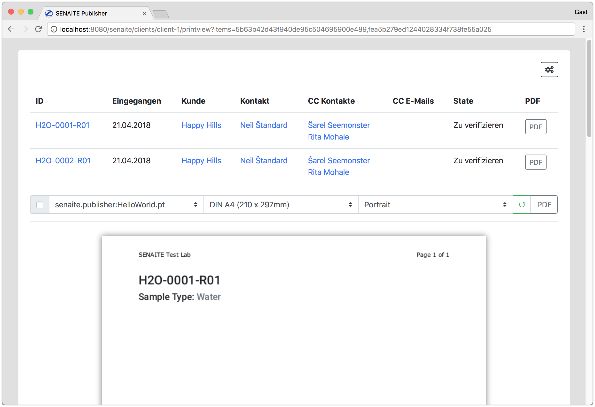


### Report View

The Report View acts as a controller for the multi- and single reports. It
provides code logic to group, sort and extract the data of the report model/collection.

Methods (functions) of the Report view are referenced by the keyword `view` in the template
and provide the business controller logic between the plain data object and SENAITE LIMS/HEALTH.

Report views can be customized per report for any specific report behavior and model.

The standard report view for models of the type Analysis Request is located here:
https://github.com/senaite/senaite.impress/blob/master/src/senaite/impress/analysisrequest/reportview.py

```html
<tal:report define="model python:view.model;">

  <tal:css define="laboratory view/laboratory;">
    <style type="text/css">
     html, body { font-size: 1em; }
     h1 { font-size: 160%; }
     h2 { font-size: 120%; }
     @page {
       font-size: 9pt;
       @top-left {
         content: '<span tal:omit-tag="" tal:content="laboratory/Name"/>';
       }
       @top-right {
         content: "<tal:t i18n:translate=''>Page</tal:t> " counter(page) " <tal:t i18n:translate=''>of</tal:t> " counter(pages);
       }
     }
    </style>
  </tal:css>

  <div class="row">
    <div class="col-sm-12">
      <h1 tal:content="model/id">This will be replaced with the ID of the model</h1>
      <h2>
        Sample Type:
        <span class="text-secondary"
              tal:content="model/SampleTypeTitle">
          This will be replaced with the Sample Type Title
        </span>
      </h2>
      <hr class="py-1"/>
      <div class="text-muted font-italic">
        Published <span tal:content="python:view.to_localized_time(model.DatePublished)"/>
        by <span tal:content="python:view.current_user.get('fullname')"/>
      </div>
    </div>
  </div>
</tal:report>
```

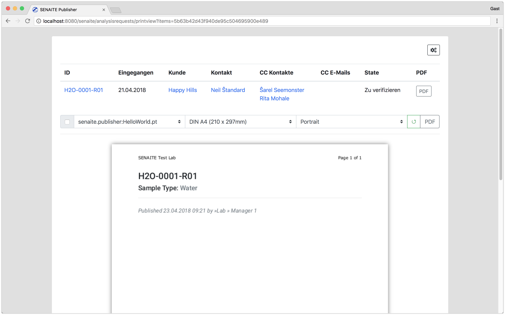


### Reports in external packages

Until now we created all reports on the file system within this package, which
is **not** the recommended way, because with future updates of
`senaite.impress`, these changes will be lost.

Therefore it is recommended to create a new
[SENAITE Add-On Package](https://docs.plone.org/4/en/develop/addons/schema-driven-forms/creating-a-simple-form/creating-a-package.html)
and put the custom reports in there. Note that the naming of the report template
is important if you are customising a multi-sample report - you MUST start or
end the template name with the word 'multi'.

In your new package `configure.zcml` you have to specify the folder where your reports live:

```xml
<configure
    xmlns="http://namespaces.zope.org/zope"
    xmlns:plone="http://namespaces.plone.org/plone">

  <!-- Report resource directory -->
  <plone:static
      directory="reports"
      type="senaite.impress.reports"/>

</configure>
```

This will integrate the `reports` directory within your package into the search
path of `senaite.impress`.

It is recommended to have a report controller view in place to avoid heavy
Python logic in the domain of the page template.

To create a custom report controller view, you need to have first a custom
browser layer defined in your `interfaces.py`:

```python
from bika.lims.interfaces import IBikaLIMS
from senaite.impress.interfaces import ILayer as ISenaiteIMPRESS
from senaite.lims.interfaces import ISenaiteLIMS


class IMyLIMSLayer(IBikaLIMS, ISenaiteLIMS, ISenaiteIMPRESS):
    """Marker interface that defines a Zope 3 browser layer.
    """
```

and register the layer in `profiles/default/browserlayer.xml`:
```xml
<layers>
  <layer name="my.lims"
         interface="my.lims.interfaces.IMyLIMSLayer" />
</layers>
``**


Then you can register the controller view in `configure.zcml`:

```xml
  <!-- View for Single Reports -->
  <adapter
      for="zope.interface.Interface
           my.lims.interfaces.IMyLIMS"
      name="AnalysisRequest"
      factory=".reportview.MySingleReportView"
      provides="senaite.impress.interfaces.IReportView"
      permission="zope2.View"/>

  <!-- View for Multi Reports -->
  <adapter
      for="zope.interface.Interface
           my.lims.interfaces.IMyLIMSLayer"
      name="AnalysisRequest"
      factory=".reportview.MyMultiReportView"
      provides="senaite.impress.interfaces.IMultiReportView"
      permission="zope2.View"/>
```


And create your own reportview.py module:

```python
from senaite.impress.analysisrequest.reportview import MultiReportView

class MyMultiReportView(MultiReportView):
    """My specific controller view for multi-reports
    """

    def __init__(self, collection, request):
        logger.info("MyMultiReportView::__init__:collection={}"
                    .format(collection))
        super(MultiReportView, self).__init__(collection, request)
        self.collection = collection
        self.request = request
```

**Note**:
Since version 1.2.4 it is also possible to register a multiadapter that adapts
the current rendering context, the report model/collection and the request:

```xml
  <!-- View for Single Reports -->
  <adapter
      for="*
           *
           my.lims.interfaces.IMyLIMS"
      name="AnalysisRequest"
      factory=".reportview.MySingleReportView"
      provides="senaite.impress.interfaces.IReportView"
      permission="zope2.View"/>

  <!-- View for Multi Reports -->
  <adapter
      for="*
           *
           my.lims.interfaces.IMyLIMSLayer"
      name="AnalysisRequest"
      factory=".reportview.MyMultiReportView"
      provides="senaite.impress.interfaces.IMultiReportView"
      permission="zope2.View"/>
```

This would allow to use the current context where `publish` view was called
can be used as well:

```python
from senaite.impress.analysisrequest.reportview import MultiReportView

class MyMultiReportView(MultiReportView):
    """My specific controller view for multi-reports
    """

    def __init__(self, context, collection, request):
        logger.info("MyMultiReportView::__init__:collection={}"
                    .format(collection))
        super(MultiReportView, self).__init__(collection, request)
        self.collection = collection
        self.context = context
        self.request = request
```


### Further Reading

`senaite.impress` comes with some default templates included. It is recommended
to read the code of these templates or use them as the base for new reports.


### senaite.impress:Default.pt

This page template is renders single reports (one AR per report).

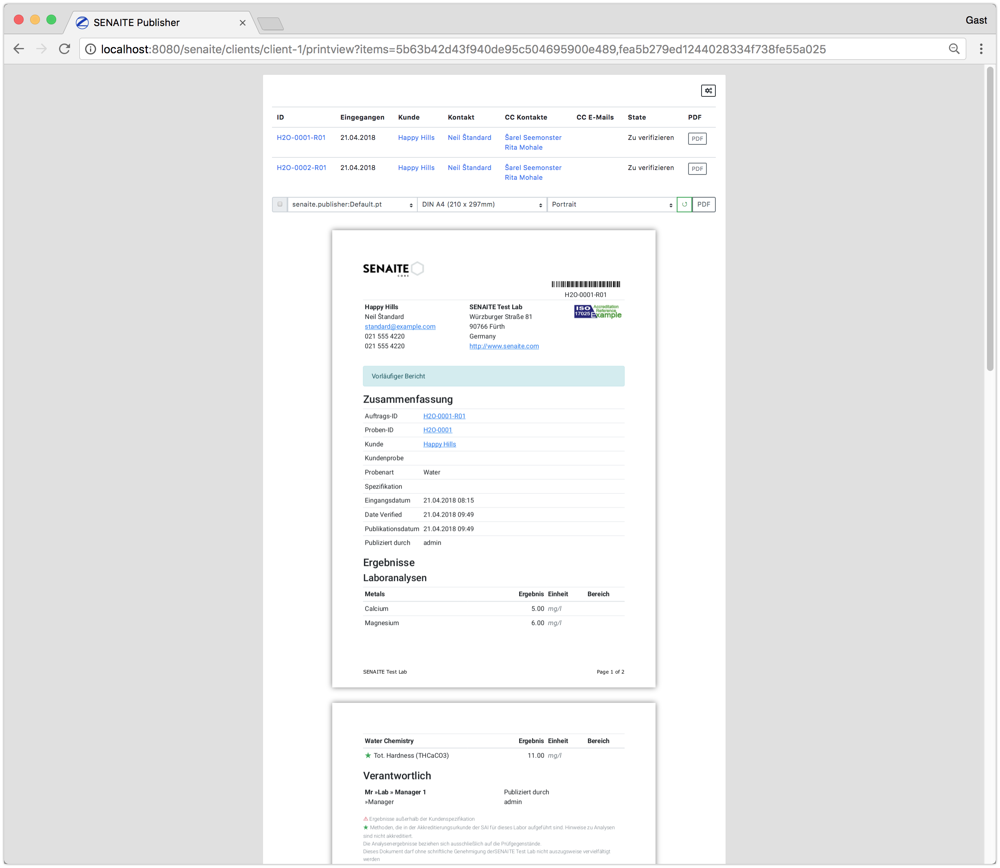


### senaite.impress:MultiDefault.pt

This page template is renders multiple reports on one report. The header and
footer will be rendered only once. The metadata of the first model (here the
Analysis Request `H20-0001-R01`) will be used for these sections and the
results/remarks/attachments sections will be repeated for all models in the
collection (`H20-0001-R01` and `H20-0002-R01`).


### senaite.impress:MultiDefaultByColumn.pt

This page template behaves like the `senaite.impress:MultiDefault.pt`, except
that the results of all models (Analysis Requests) will be rendered in columns
side by side.


